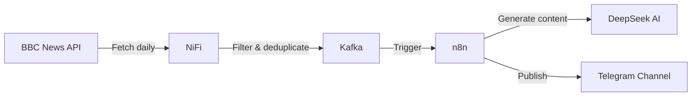

# 📰 English News Telegram Bot

An automated pipeline that fetches English news, processes them through AI, and publishes educational posts with vocabulary explanations and quizzes to a Telegram channel.


## 🚀 Features

- **Automated News Fetching**: Daily collection of fresh news from BBC News API
- **Duplicate Prevention**: Distributed cache in NiFi ensures no news is published twice
- **AI-Powered Content Generation**: 
  - 📝 Engaging news summaries with hashtags
  - 📚 Detailed vocabulary explanations with pronunciation
  - ✨ Grammar breakdowns with real-world examples
  - 🎯 Interactive quizzes to test understanding
- **Multi-Stage Processing**:
  - NiFi → Data ingestion, filtering, and deduplication
  - Kafka → Reliable message queuing
  - n8n → Workflow orchestration and AI integration
  - Telegram → Content delivery
- **HTML Formatting**: All posts are beautifully formatted with Telegram-compatible HTML tags

## 🏗️ Architecture

The pipeline consists of several components working together:


## Components
- NiFi: Fetches news daily at 8 AM, filters out items without images/summaries, checks for duplicates using distributed cache, and publishes to Kafka
- Kafka: Acts as a reliable buffer between NiFi and n8n
- n8n: Orchestrates the entire workflow:
  - Parses incoming JSON from Kafka
  - Formats news with proper HTML
  - Generates vocabulary explanations using DeepSeek AI
  - Creates interactive quizzes
  - Publishes to Telegram channel
  - DeepSeek AI: Powers all content generation with carefully crafted prompts

## 📋 Prerequisites
- Docker and Docker Compose (for running the stack)
- VPS or server with:
- NiFi 2.7.2+
- Kafka 3.0+
- n8n 1.9+
- 4GB+ RAM recommended
- Telegram Bot Token (from @BotFather)
- DeepSeek API Key

## 🛠️ Installation
### 1. Clone the repositor
```bash
git clone https://github.com/yourusername/english-news-telegram-bot.git
cd english-news-telegram-bot
```
### 2. Set up environment variables
Create .env file:

```env
TELEGRAM_BOT_TOKEN=your_bot_token
DEEPSEEK_API_KEY=your_api_key
KAFKA_BOOTSTRAP_SERVERS=kafka:9092
```
### 3. Import the flows
**NiFi Flow**
- Access NiFi UI (default: http://localhost:8080/nifi)
- Drag "Process Group" onto canvas
- Select "Upload" and choose nifi_flows/English-In-Telegram.json
- Configure the MapCacheClientService and Kafka3ConnectionService with your settings

**n8n Workflow**
- Access n8n UI (default: http://localhost:5678)
- Go to Workflows → Import from File
- Select n8n_flows/EnglishWithNews.json
- Update credentials:
  - Kafka connection
  - DeepSeek API credentials
  - Telegram bot credentials

### 4. Configure Telegram channel
- Add your bot as administrator to your Telegram channel
- Update the chat_id in n8n workflow (currently set to @english_lessons_with_news)

## 📊 Workflow Explanation
**NiFi Flow (English-In-Telegram.json)**
- GenerateFlowFile triggers at 8 AM daily
- UpdateAttribute sets the API URL and HTTP method
- InvokeHTTP fetches data from BBC News API
- SplitJson separates individual news items
- EvaluateJsonPath extracts title, summary, image_link, news_link
- RouteOnAttribute filters items with images and summaries
- FetchDistributedMapCache checks for duplicates
- AttributesToCSV + PutDistributedMapCache stores news_link as processed
- ControlRate ensures 1 news per 3 hours
- PublishKafka sends to bbc-news-api topic

**n8n Workflow (EnglishWithNews.json)**
- Kafka Trigger listens for new messages
- Code Node parses JSON from Kafka
- Code Node formats post with HTML
- Basic LLM Chain adds relevant hashtags
- HTTP Request downloads news image
- Telegram sends photo with formatted news
- Basic LLM Chain generates vocabulary explanations
- Telegram sends explanation post
- Basic LLM Chain creates quiz in JSON format
- Code Node cleans LLM response
- Code Node randomizes quiz options and prepares for Telegram
- HTTP Request publishes quiz via Telegram API
## 🎨 Content Examples
**News Post**
```text
<b>Nasa announces change to its Moon landing plans</b>
It is adding an extra mission to its Artemis programme before landing astronauts on the Moon.

🔗 <a href="https://bbc.com/news/articles/c6270030neyo">Read more</a>

@english_lessons_with_news
#Space #EnglishNews #LearnEnglish #Artemis
```
**Vocabulary Explanation**
```text
<b>🚀 Let's explore the language behind the news!</b>

<b>to announce</b> [əˈnaʊns] — объявить, сделать официальное заявление.
<i>The company will announce its new product next week.</i>

<b>a change to plans</b> — изменение планов. Обрати внимание на предлог TO!
<i>We had a last-minute change to our travel plans.</i>

<b>✨ Grammar: Infinitive of purpose</b>
Use "to + verb" to explain why something is done.
<i>NASA is adding a mission to test new technology.</i>
```
**Quiz**
```text
📊 How do you say "изменение планов" correctly?

• a change to plans
• a change of plans
• a change for plans
• a change in plans
(quiz mode)
```
## 🔧 Customization
**Changing News Source**
- Update the URL in NiFi's UpdateAttribute processor
- Adjust SplitJson path to match your API response structure

**Modifying Prompts**
All AI prompts are in the Basic LLM Chain nodes in n8n. You can:
- Adjust the tone (formal/casual)
- Change the number of vocabulary words
- Modify quiz difficulty
- Add/remove sections

**Publishing Schedule**
- NiFi: Change GenerateFlowFile cron expression (currently 0 0 8 * * ?)
- n8n: Add Wait nodes between posts if needed

## 📝 License
MIT License - feel free to use and modify for your own projects!

## 🤝 Contributing
Contributions are welcome! Please feel free to submit a Pull Request.

## ⚠️ Notes
- The BBC News API used is an unofficial service. For production, consider using official RSS feeds
- Distributed Map Cache in NiFi resets on restart - for persistent cache, consider Redis
- Monitor your DeepSeek API usage to avoid unexpected costs
- The workflow assumes 1 news item per execution - adjust ControlRate if your source returns more

## 📞 Support
If you encounter any issues, please open an issue on GitHub.
